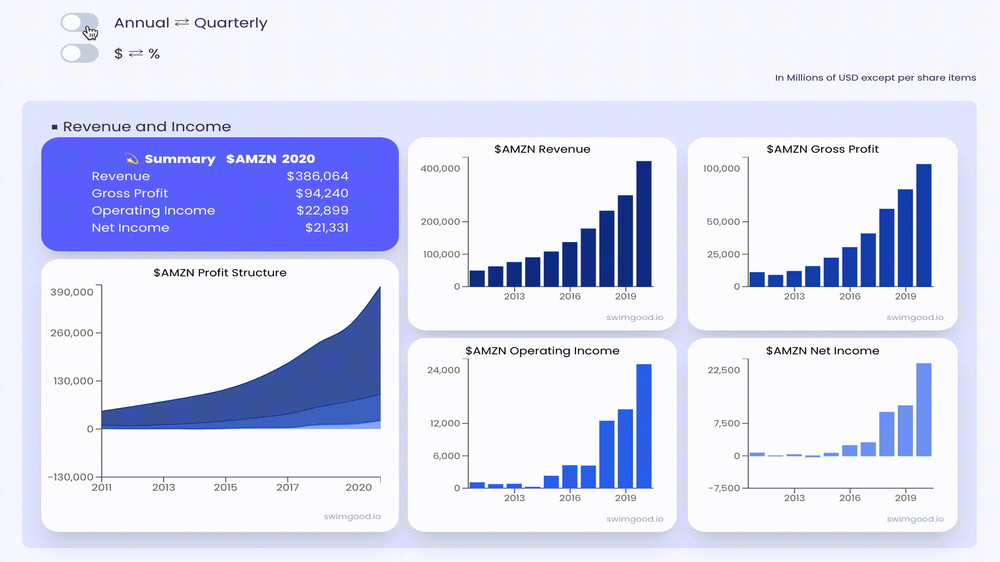

  

<h1 align="center">
  🏊‍♂️Swimgood.io
</h1>

## [🏊‍♂️Swimgood.io](https://swimgood.io/)
### 米国株の決算情報APIから情報を取得・加工し、洗練されたビジュアルに変換する株分析サービス(🎉ユーザー数6000人以上を獲得🎉)

## 🌞 主な実装
- React Hooksの利用
- Promise, async/await を使った非同期処理
- 銘柄検索のフォーム作成
- 外部API通信、取得JSONデータの加工
- useAppContextを使ったstate管理
- Next.jsのpage推移管理、getStaticProps/getServerSidePropsの使い分け
- UI コンポーネントフレームワークを使ったスタイリング
- レスポンシブデザイン対応

## 🧐 使用技術
  - HTML / CSS (Chakra UI / styled-components)
  - Javascript
  - React
  - Next.js
  - Charts.js

## 📚 他のプロジェクト
  - [Vocamy🥑](https://github.com/hiropalla1692/vocamy)
  - [Instant URL Sender 📩](https://abc.xyz)
  - [My Portfolio ☕️](https://github.com/hiropalla1692/my-portfolio)
  - [COVID-19 Visualizer🦠](https://github.com/hiropalla1692/covid-19-checker)

## 📩 Contact
- [Mail](mailto:hirokuni0719@gmail.com)
- [Github](https://github.com/hiropalla1692/)
- [Wantedly](https://www.wantedly.com/users/82225561)